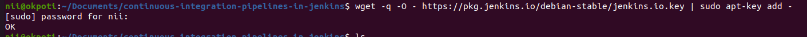
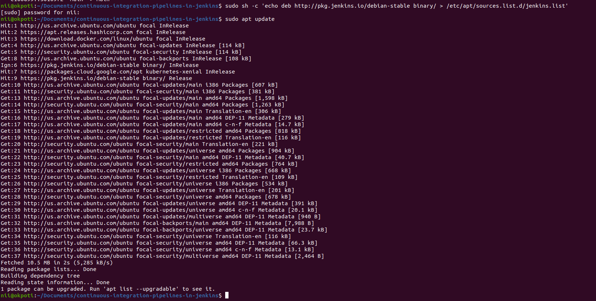
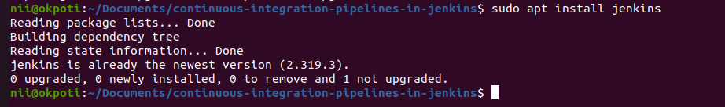
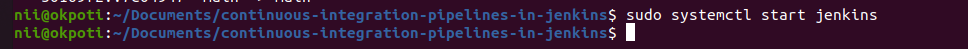
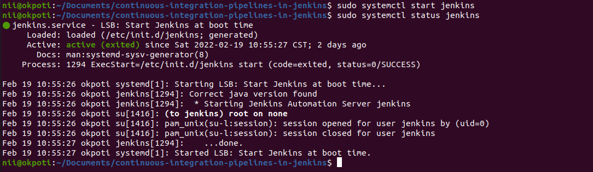
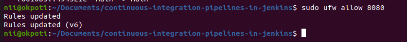
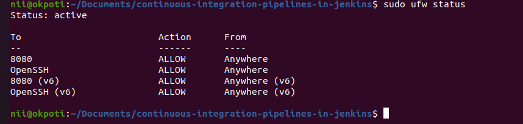
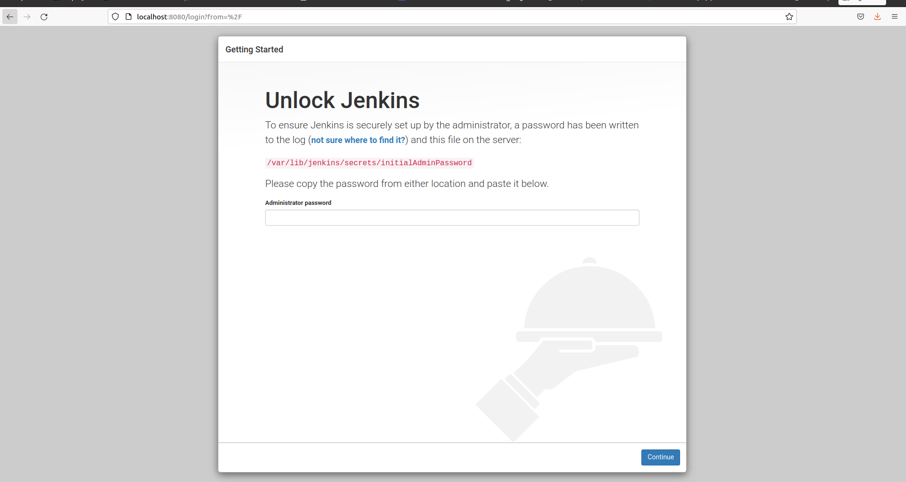
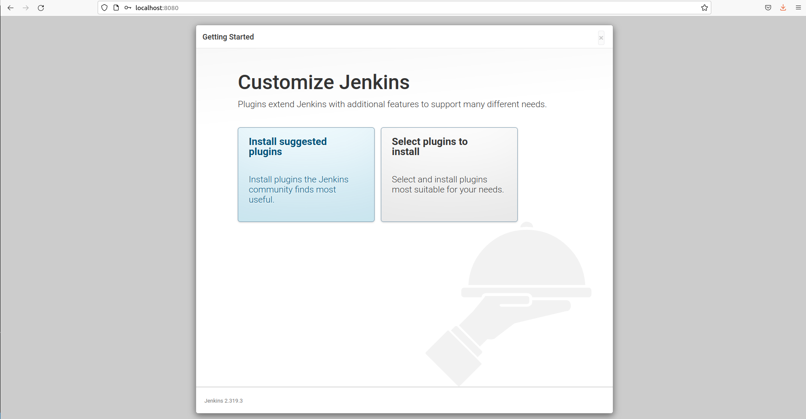

# continuous-integration-pipelines-in-jenkins
in this project, i will demonstrate how to set up Jenkins to automatically test an application when changes are pushed to a repository.


# Project 3: 

# **Continuous Integration Pipelines in Jenkins**

Jenkins is an open source automation server intended to automate repetitive technical tasks involved in the continuous integration and delivery of software. With a robust ecosystem of plugins and broad support, Jenkins can handle a diverse set of workloads to build, test, and deploy applications.

In this project, i will demonstrate how to set up Jenkins to automatically test an application when changes are pushed to a repository.

For this project, we will be integrating Jenkins with GitHub so that Jenkins is notified when new code is pushed to the repository. When Jenkins is notified, it will checkout the code and then test it within Docker containers to isolate the test environment from the Jenkins host machine. We will be using an example Node.js application to show how to define the CI/CD process for a project.

**Prerequisites**

To follow this project, you will need:

One Ubuntu 20.04 server configured with a non-root sudo user and firewall. We recommend starting with at least 1 GB of RAM. Visit Jenkins’s “Hardware Recommendations” for guidance in planning 	the capacity of a production-level Jenkins installation.

Oracle JDK 11 installed

To follow along with this project, you will need an Ubuntu 20.04 server with at least 1G of RAM configured with a secure Jenkins installation. To properly secure the web interface, you will need to assign a domain name to the Jenkins server. Follow these guides to learn how to set up Jenkins in the expected format:

# How To Install Jenkins on Ubuntu 20.04

When faced with repetitive technical tasks, finding automation solutions that work can be a chore. With Jenkins, an open-source automation server, you can efficiently manage tasks from building to deploying software. Jenkins is Java-based, installed from Ubuntu packages or by downloading and running its web application archive (WAR) file — a collection of files that make up a complete web application to run on a server.

In this project,  we’ll install Jenkins on Ubuntu 20.04, start the development server and create an administrative user to get you started in exploring what Jenkins can do. 

# Step 1 — Installing Jenkins

The version of Jenkins included with the default Ubuntu packages is often behind the latest available version from the project itself. To ensure you have the latest fixes and features, use the project-maintained packages to install Jenkins.

First, add the repository key to the system:

```
wget -q -O - https://pkg.jenkins.io/debian-stable/jenkins.io.key | sudo apt-key add -
```

After the key is added the system will return with OK




Next, let’s append the Debian package repository address to the server’s sources.list:

sudo sh -c 'echo deb http://pkg.jenkins.io/debian-stable binary/ > /etc/apt/sources.list.d/jenkins.list'


After both commands have been entered, we’ll run update so that apt will use the new repository.

```
sudo apt update
```

you screen should look something like this




Finally, we’ll install Jenkins and its dependencies using the command:

```
sudo apt install jenkins
```

in my case i had already installed jenkins so i run the command my output looked something like the below output instead




Now that Jenkins and its dependencies are in place, we’ll start the Jenkins server.

**Step 2 — Starting Jenkins**


Let’s start Jenkins by using systemctl:

```
sudo systemctl start jenkins
```




Since systemctl doesn’t display status output, i’ll use the status command to verify that Jenkins started successfully:

```
sudo systemctl status jenkins
```

If everything went well, the beginning of the status output shows that the service is active and configured to start at boot:
if you get the green dot shows, then you've successfully started jenkins ans is ready.





Now that Jenkins is up and running, let’s adjust our firewall rules so that we can reach it from a web browser to complete the initial setup.

# Step 3 — Opening the Firewall

You will set up a UFW firewall. By default, Jenkins runs on port 8080. We’ll open that port using ufw:

```
sudo ufw allow 8080
```




***Note:*** If the firewall is inactive, the following commands will allow OpenSSH and enable the firewall:

but before you run the following command, make sure you install a ssh server by running the this command otherwise you might get an error

```
sudo apt-get install openssh-server
```
one that is donw with, proceed with the following commands

```
sudo ufw allow OpenSSH
sudo ufw enable
```


Check ufw’s status to confirm the new rules:

```
sudo ufw statu
```

You’ll notice that traffic is allowed to port 8080 from anywhere:




With Jenkins installed and our firewall configured, we can complete the installation stage and dive into Jenkins setup.


# Step 4 — Setting Up Jenkins

To set up your installation, visit Jenkins on its default port, 8080, using your server domain name or IP address: http://your_server_ip_or_domain:8080

to do this, go to your browser and type "localhost:8080" in the browser tap

You should receive the **Unlock Jenkins** screen, which displays the location of the initial password:




In the terminal window, use the cat command to display the password:

```
sudo cat /var/lib/jenkins/secrets/initialAdminPassword
```

Copy the 32-character alphanumeric password from the terminal and paste it into the **Administrator password** field, then click **Continue**.

The next screen presents the option of installing suggested plugins or selecting specific plugins:





We’ll click the **Install suggested plugins option**, which will immediately begin the installation process.

