# continuous-integration-pipelines-in-jenkins
in this project, i will demonstrate how to set up Jenkins to automatically test an application when changes are pushed to a repository.


# Project 3: 

# **Continuous Integration Pipelines in Jenkins**

Jenkins is an open source automation server intended to automate repetitive technical tasks involved in the continuous integration and delivery of software. With a robust ecosystem of plugins and broad support, Jenkins can handle a diverse set of workloads to build, test, and deploy applications.

In this project, i will demonstrate how to set up Jenkins to automatically test an application when changes are pushed to a repository.

For this project, we will be integrating Jenkins with GitHub so that Jenkins is notified when new code is pushed to the repository. When Jenkins is notified, it will checkout the code and then test it within Docker containers to isolate the test environment from the Jenkins host machine. We will be using an example Node.js application to show how to define the CI/CD process for a project.

**Prerequisites**

To follow this project, you will need:

One Ubuntu 20.04 server configured with a non-root sudo user and firewall. We recommend starting with at least 1 GB of RAM. Visit Jenkins’s “Hardware Recommendations” for guidance in planning 	the capacity of a production-level Jenkins installation.

Oracle JDK 11 installed

To follow along with this project, you will need an Ubuntu 20.04 server with at least 1G of RAM configured with a secure Jenkins installation. To properly secure the web interface, you will need to assign a domain name to the Jenkins server. Follow these guides to learn how to set up Jenkins in the expected format:

# How To Install Jenkins on Ubuntu 20.04

When faced with repetitive technical tasks, finding automation solutions that work can be a chore. With Jenkins, an open-source automation server, you can efficiently manage tasks from building to deploying software. Jenkins is Java-based, installed from Ubuntu packages or by downloading and running its web application archive (WAR) file — a collection of files that make up a complete web application to run on a server.

In this project,  we’ll install Jenkins on Ubuntu 20.04, start the development server and create an administrative user to get you started in exploring what Jenkins can do. 

# Step 1 — Installing Jenkins

The version of Jenkins included with the default Ubuntu packages is often behind the latest available version from the project itself. To ensure you have the latest fixes and features, use the project-maintained packages to install Jenkins.

First, add the repository key to the system:

```
wget -q -O - https://pkg.jenkins.io/debian-stable/jenkins.io.key | sudo apt-key add -
```

After the key is added the system will return with OK


Next, let’s append the Debian package repository address to the server’s sources.list:

sudo sh -c 'echo deb http://pkg.jenkins.io/debian-stable binary/ > /etc/apt/sources.list.d/jenkins.list'


After both commands have been entered, we’ll run update so that apt will use the new repository.

```
sudo apt update
```

you screen should look something like this


Finally, we’ll install Jenkins and its dependencies using the command:

```
sudo apt install jenkins
```

in my case i had already installed jenkins so i run the command my output looked something like the below output instead


Now that Jenkins and its dependencies are in place, we’ll start the Jenkins server.

**Step 2 — Starting Jenkins**


Let’s start Jenkins by using systemctl:

```
sudo systemctl start jenkins
```


Since systemctl doesn’t display status output, i’ll use the status command to verify that Jenkins started successfully:

```
sudo systemctl status jenkins
```

If everything went well, the beginning of the status output shows that the service is active and configured to start at boot:
if you get the green dot shows, then you've successfully started jenkins ans is ready.


Now that Jenkins is up and running, let’s adjust our firewall rules so that we can reach it from a web browser to complete the initial setup.

# Step 3 — Opening the Firewall

You will set up a UFW firewall. By default, Jenkins runs on port 8080. We’ll open that port using ufw:

```
sudo ufw allow 8080
```


***Note:*** If the firewall is inactive, the following commands will allow OpenSSH and enable the firewall:

but before you run the following command, make sure you install a ssh server by running the this command otherwise you might get an error

```
sudo apt-get install openssh-server
```
one that is donw with, proceed with the following commands

```
sudo ufw allow OpenSSH
sudo ufw enable
```


Check ufw’s status to confirm the new rules:

```
sudo ufw statu
```

You’ll notice that traffic is allowed to port 8080 from anywhere:


With Jenkins installed and our firewall configured, we can complete the installation stage and dive into Jenkins setup.


# Step 4 — Setting Up Jenkins

To set up your installation, visit Jenkins on its default port, 8080, using your server domain name or IP address: http://your_server_ip_or_domain:8080

to do this, go to your browser and type "localhost:8080" in the browser tap

You should receive the **Unlock Jenkins** screen, which displays the location of the initial password:


In the terminal window, use the cat command to display the password:

```
sudo cat /var/lib/jenkins/secrets/initialAdminPassword
```

Copy the 32-character alphanumeric password from the terminal and paste it into the **Administrator password** field, then click **Continue**.

The next screen presents the option of installing suggested plugins or selecting specific plugins:


We’ll click the **Install suggested plugins option**, which will immediately begin the installation process.

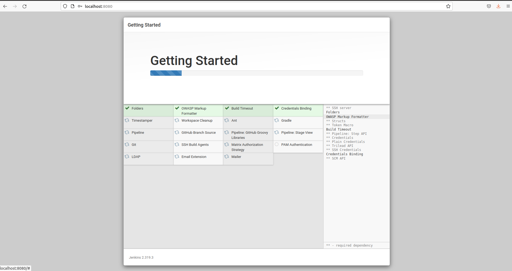


When the installation is complete, you’ll be prompted to set up the first administrative user. It’s possible to skip this step and continue as admin using the initial password we used above, but we’ll take a moment to create the user.

**Note:** The default Jenkins server is NOT encrypted, so the data submitted with this form is not protected. 

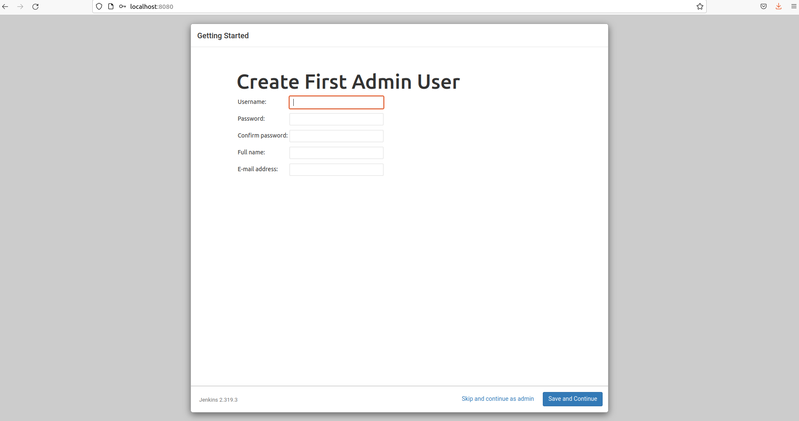


Enter the name and password for your user:

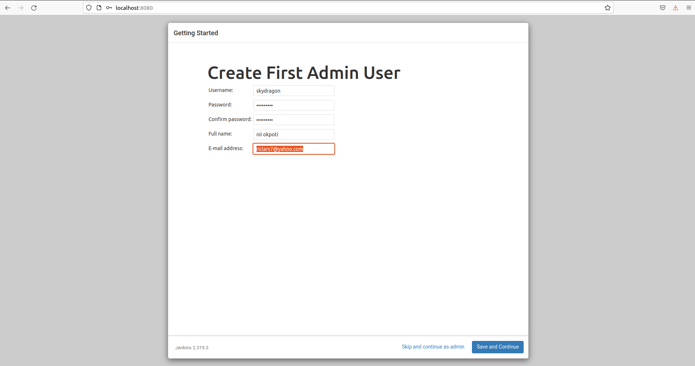


You’ll receive an Instance Configuration page that will ask you to confirm the preferred URL for your Jenkins instance. Confirm either the domain name for your server or your server’s IP address:

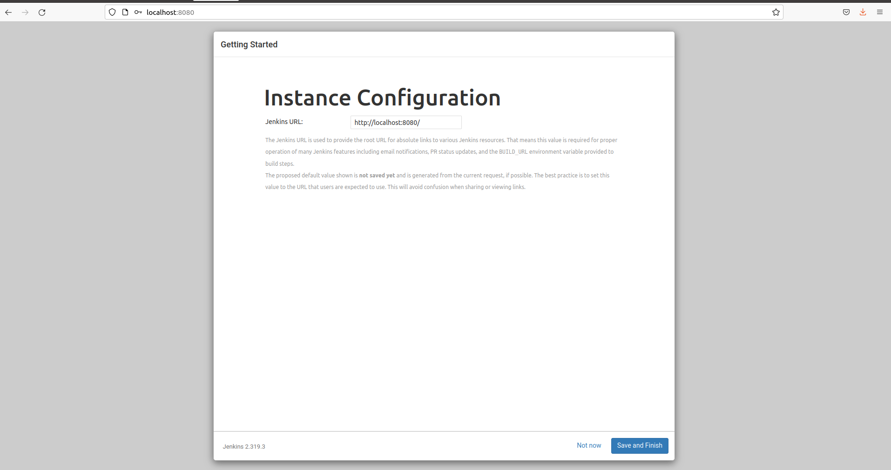

After confirming the appropriate information, click **Save and Finish**. You’ll receive a confirmation page confirming that **“Jenkins is Ready!”:**
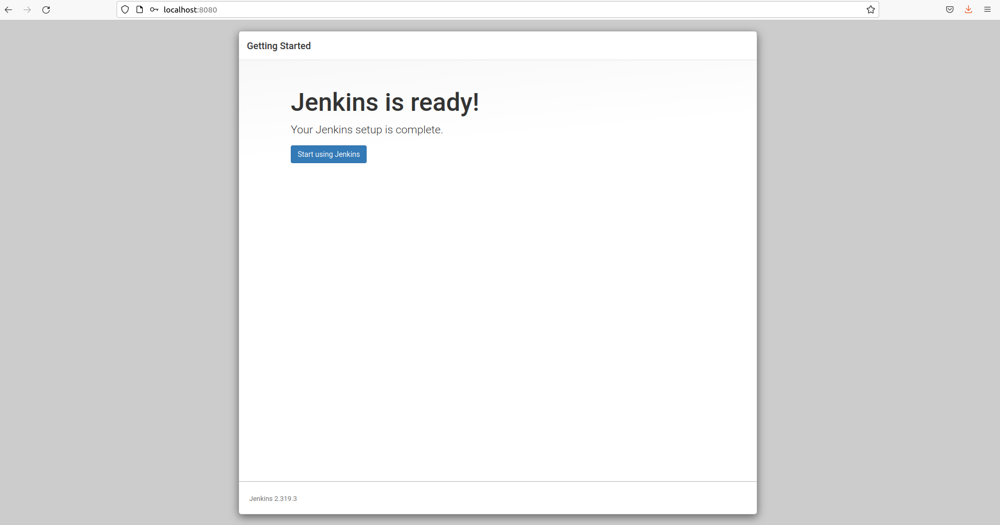


Click **Start using Jenkins** to visit the main Jenkins dashboard:

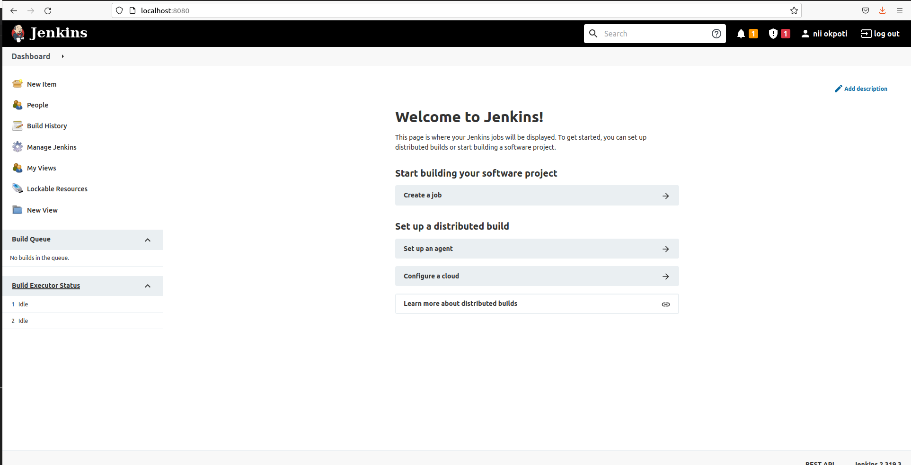

At this point, you have completed a successful installation of Jenkins.

# Conclusion
In this project, you installed Jenkins using the project-provided packages, started the server, opened the firewall, and created an administrative user. At this point, you can start exploring Jenkins.

# 2. How to Install Nginx on Ubuntu 20.04

[Nginx](https://www.nginx.com/) is one of the most popular web servers in the world and is responsible for hosting some of the largest and highest-traffic sites on the internet. It is a lightweight choice that can be used as either a web server or reverse proxy.

In this project, we’ll discuss how to install Nginx on your Ubuntu 20.04 server, adjust the firewall, manage the Nginx process, and set up server blocks for hosting more than one domain from a single server.


# Prerequisites

Before you begin this project, you should have a regular, non-root user with sudo privileges configured on your server.

You will also optionally want to have registered a domain name before completing the last steps of this project. 

when you have an account available, log in as your non-root user to begin.

# Step 1 – Installing Nginx

Because Nginx is available in Ubuntu’s default repositories, it is possible to install it from these repositories using the apt packaging system.

Since this is our first interaction with the apt packaging system in this session, we will update our local package index so that we have access to the most recent package listings. Afterwards, we can install nginx:


```
sudo apt update
sudo apt install nginx
```

After accepting the procedure, apt will install Nginx and any required dependencies to your server.

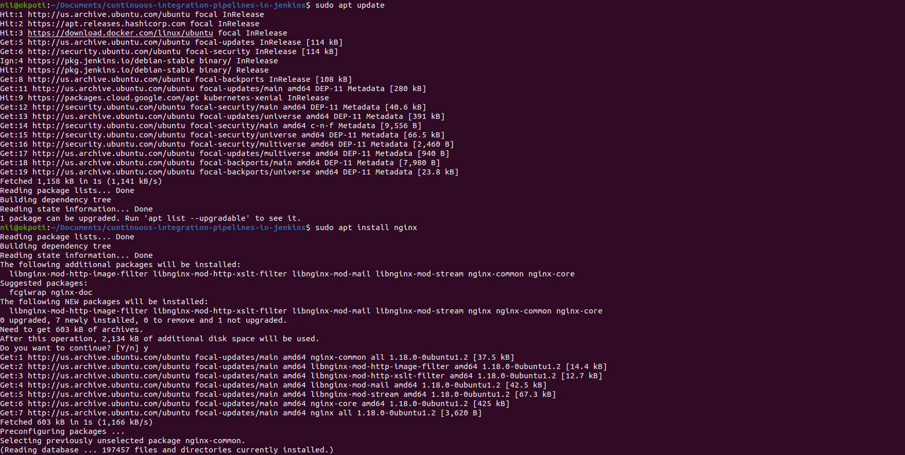

# Step 2 – Adjusting the Firewall

Before testing Nginx, the firewall software needs to be adjusted to allow access to the service. Nginx registers itself as a service with ufw upon installation, making it straightforward to allow Nginx access.

List the application configurations that ufw knows how to work with by typing:

```
sudo ufw app list
```
You should get a listing of the application profiles:

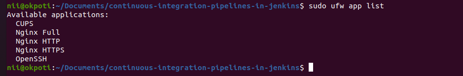

as you can see, there are three profiles availlable for Nginx:

Nginx Full: This profile opens both port 80 (normal, unencrypted web traffic) and port 443 (TLS/SSL encrypted traffic)

Nginx HTTP: This profile opens only port 80 (normal, unencrypted web traffic)

Nginx HTTPS: This profile opens only port 443 (TLS/SSL encrypted traffic)

It is recommended that you enable the most restrictive profile that will still allow the traffic you’ve configured. Right now, we will only need to allow traffic on port 80.

You can enable this by typing:

```
sudo ufw allow 'Nginx HTTP'
```
You can verify the change by typing:

```
sudo ufw status
```

The output will indicated which HTTP traffic is allowed:

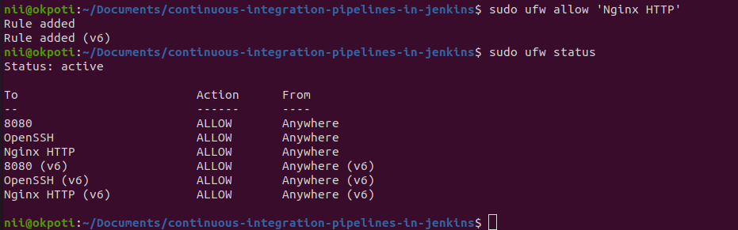


### Step 3 – Checking your Web Server

At the end of the installation process, Ubuntu 20.04 starts Nginx. The web server should already be up and running.

We can check with the `systemd` init system to make sure the service is running by typing:

```
systemctl status nginx
```

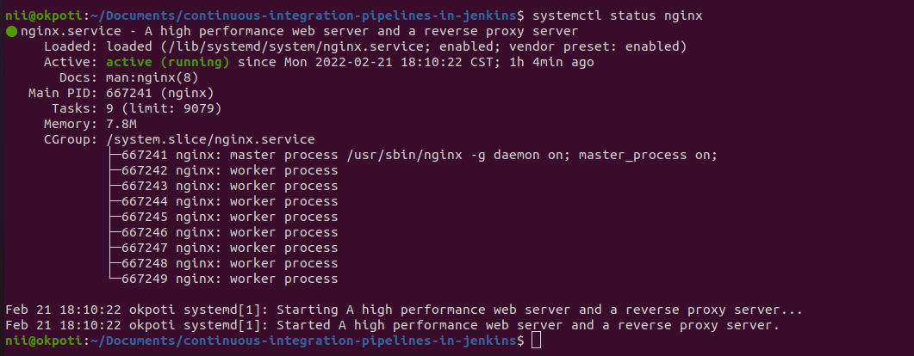


with the greenlight on, this indicates to us that the web server is running.


As confirmed by this out, the service has started successfully. However, the best way to test this is to actually request a page from Nginx.

You can access the default Nginx landing page to confirm that the software is running properly by navigating to your server’s IP address. If you do not know your server’s IP address, you can find it by using the icanhazip.com tool, which will give you your public IP address as received from another location on the internet:

```
curl -4 icanhazip.com
```

When you have your server’s IP address, enter it into your browser’s address bar:

```
http://your_server_ip
```


You should receive the default Nginx landing page:


# Step 4 – Managing the Nginx Process

Now that you have your web server up and running, let’s review some basic management commands.

To stop your web server, type:
```
sudo systemctl stop nginx
```

To start the web server when it is stopped, type:

```
sudo systemctl start nginx
```

To stop and then start the service again, type:

```
sudo systemctl restart nginx
```

If you are only making configuration changes, Nginx can often reload without dropping connections. To do this, type:

```
sudo systemctl reload nginx
```
By default, Nginx is configured to start automatically when the server boots. If this is not what you want, you can disable this behavior by typing:

```
sudo systemctl disable nginx
```

To re-enable the service to start up at boot, you can type:
```
sudo systemctl enable nginx
```

You have now learned basic management commands and should be ready to configure the site to host more than one domain.


# How to Secure Nginx with Let’s Encrypt on Ubuntu 20.04


Let’s Encrypt is a Certificate Authority (CA) that provides an easy way to obtain and install free TLS/SSL certificates, thereby enabling encrypted HTTPS on web servers. It simplifies the process by providing a software client, Certbot, that attempts to automate most (if not all) of the required steps. Currently, the entire process of obtaining and installing a certificate is fully automated on both Apache and Nginx.

In this project, you will use Certbot to obtain a free SSL certificate for Nginx on Ubuntu 20.04 and set up your certificate to renew automatically.

This project will use a separate Nginx server configuration file instead of the default file. We recommend creating new Nginx server block files for each domain because it helps to avoid common mistakes and maintains the default files as a fallback configuration.

# Prerequisites
For this step I will need the following in order to continue:

One Ubuntu 20.04 server set up including a sudo-enabled non-root user and a firewall.

A registered domain name. This project will use example.com throughout. You can purchase a domain name from Namecheap, get one for free with Freenom, or use the domain registrar of your choice.

Both of the following DNS records set up for your server.

A record with example.com pointing to your server’s public IP address.

A record with www.example.com pointing to your server’s public IP address.

A record with www.example.com pointing to your server’s public IP address.

# Step 1 — Installing Certbot

The first step to using Let’s Encrypt to obtain an SSL certificate is to install the Certbot software on your server.

Install Certbot and it’s Nginx plugin with apt:

```
sudo apt install certbot python3-certbot-nginx
```

Certbot is now ready to use, but in order for it to automatically configure SSL for Nginx, we need to verify some of Nginx’s configuration.

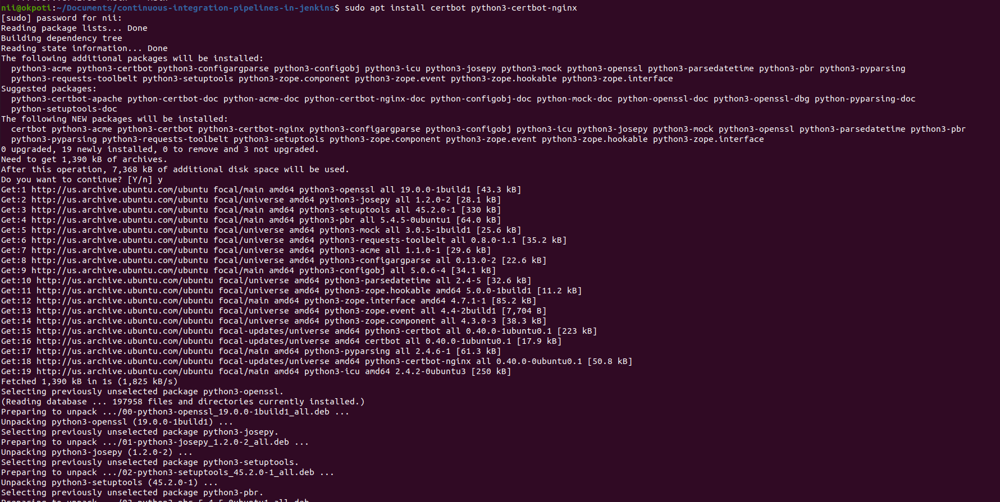

# Step 2 — Confirming Nginx’s Configuration

Certbot needs to be able to find the correct server block in your Nginx configuration for it to be able to automatically configure SSL. Specifically, it does this by looking for a server_name directive that matches the domain you request a certificate for.

You should have a server block for your domain at /etc/nginx/sites-available/example.com with the server_name directive already set appropriately.

To check, open the configuration file for your domain using nano or your favorite text editor:

```
sudo nano /etc/nginx/sites-available/example.com
```

